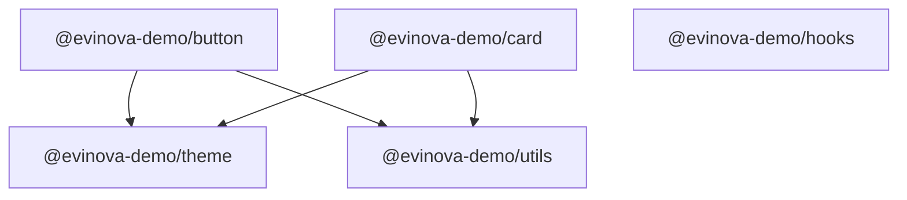

# Evinova Packages Demo

**A completely ordinary pnpm monorepo that publishes to [bit.cloud](https://bit.cloud) — no Bit CLI, no Bit config, no lock-in.**

The entire Bit integration is **one file** ([`.npmrc`](./.npmrc)) — a registry URL and a token:

```ini
@evinova-demo:registry=https://node-registry.bit.cloud
//node-registry.bit.cloud/:_authToken=${BIT_CLOUD_TOKEN}
always-auth=true
```

Everything else is the tooling your team already uses: pnpm workspaces, TypeScript, vitest, Changesets, GitHub Actions.

## What this demonstrates

| Capability | Where in this repo | Docs |
|---|---|---|
| Publish packages to bit.cloud with plain `npm`/`pnpm` | [`package.json` scripts](./package.json), any `packages/*` | [Publishing packages](https://bit.cloud/docs/packages/publishing-packages) |
| Bulk publish (all packages, dependency order) | `pnpm publish:all` / [manual workflow](./.github/workflows/publish-manual.yml) | [Managing packages](https://bit.cloud/docs/packages/managing-packages) |
| Individual publish (one package) | `pnpm --filter @evinova-demo/button publish` / manual workflow dropdown | [Managing packages](https://bit.cloud/docs/packages/managing-packages) |
| Automated releases — only changed packages | [Changesets](./.changeset) + [`release.yml`](./.github/workflows/release.yml) | [Publishing packages](https://bit.cloud/docs/packages/publishing-packages) |
| Registry auth, local and CI, zero secrets in-repo | [`.npmrc`](./.npmrc) + `BIT_CLOUD_TOKEN` | [Configuring .npmrc](https://bit.cloud/docs/packages/configuring-npmrc) |
| Works alongside npmjs / other registries | scoped registry — only `@evinova-demo/*` touches bit.cloud | [External registries](https://bit.cloud/docs/packages/external-registries) |
| Hosted docs & READMEs per package/version | each package's `README.md`, rendered on its bit.cloud page | [Managing packages](https://bit.cloud/docs/packages/managing-packages) |

## The packages



| Package | Description |
|---|---|
| [`@evinova-demo/theme`](./packages/theme) | Design tokens — colors, spacing, radii, typography |
| [`@evinova-demo/utils`](./packages/utils) | Framework-free helpers (`cx`, `truncate`, `formatDate`) |
| [`@evinova-demo/hooks`](./packages/hooks) | React hooks (`useToggle`, `useDebounce`) |
| [`@evinova-demo/button`](./packages/button) | Button component consuming theme + utils |
| [`@evinova-demo/card`](./packages/card) | Card component consuming theme + utils |

Internal dependencies use pnpm's `workspace:*` protocol. At publish time pnpm rewrites them to real semver ranges, so consumers installing `@evinova-demo/button` pull `theme` and `utils` from the bit.cloud registry automatically.

## Quickstart

### 1. Get a bit.cloud token

Grab a token from your [bit.cloud settings](https://bit.cloud/settings/access-tokens) (or `bit config get user.token` on a machine where you've run `bit login` — no Bit CLI needed otherwise).

```bash
export BIT_CLOUD_TOKEN="<your token>"
```

### 2. Install, build, test

```bash
pnpm install
pnpm build
pnpm test
```

### 3. Publish — your choice of granularity

```bash
pnpm publish:dry                                # rehearsal, publishes nothing
pnpm publish:all                                # bulk: every package, dependency order
pnpm --filter @evinova-demo/button publish      # individual: one package
```

Published packages appear at **https://bit.cloud/evinova-demo** — each with its README rendered, versions listed, and install instructions for npm/pnpm/yarn.

## CI/CD (GitHub Actions)

| Workflow | Trigger | What it does |
|---|---|---|
| [CI](./.github/workflows/ci.yml) | every PR / push to main | install → build → test |
| [Release](./.github/workflows/release.yml) | push to main | Changesets opens a "Version Packages" PR; merging it publishes **only the changed packages** |
| [Publish (manual)](./.github/workflows/publish-manual.yml) | manual dispatch | dropdown: publish one package or all, on demand |

One-time setup: add `BIT_CLOUD_TOKEN` as a repo secret (`Settings → Secrets and variables → Actions`).

### Day-to-day release flow

```bash
# 1. Make a change, then declare it:
pnpm changeset          # pick packages + semver bump, describe the change
# 2. Merge the PR. The Release workflow opens "chore: version packages".
# 3. Merge that PR → changed packages publish to bit.cloud. Done.
```

(A changeset on a shared package like `utils` cascades: Changesets automatically patch-bumps the packages that depend on it — `button` and `card` — so downstream consumers always get a compatible, republished version.)

## Why bit.cloud as a registry?

- **Zero migration** — this repo is proof: one `.npmrc` file, standard tooling.
- **Docs included** — every package version gets its README, changelog and metadata rendered; no separate docs site to maintain.
- **Scoped, not global** — only `@evinova-demo/*` resolves from bit.cloud; everything else stays on npmjs (or proxy npmjs through bit.cloud — see [external registries](https://bit.cloud/docs/packages/external-registries)).
- **Team & org management** — access control per org/scope on [bit.cloud](https://bit.cloud/evinova-demo).
- **A path to more** — the same packages can later graduate to full Bit components (compositions, previews, dependency graphs, Ripple CI) without changing how consumers install them.

## Troubleshooting

- **`WARN Issue while reading ".../.npmrc"` / `Failed to replace env in config: ${BIT_CLOUD_TOKEN}` on install** — `pnpm install` still exits `0`, but export the variable to silence it: `export BIT_CLOUD_TOKEN=""` (an empty string is fine for install-only; a real token is only required to publish).
- **401/403 on publish** — token missing/expired, or your bit.cloud user lacks write access to the `evinova-demo` org.
- **"version already exists"** — the registry is immutable per version (a feature); bump with `pnpm changeset` and republish.
