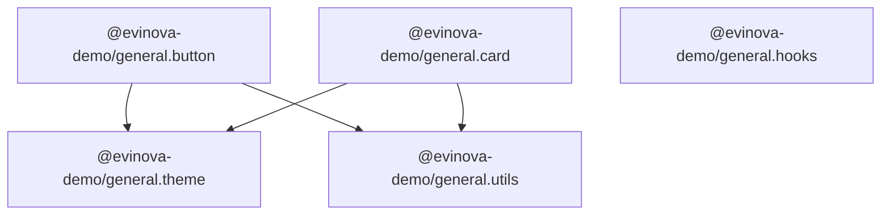

# pnpm Monorepo Packages Demo

[](https://github.com/teambit/pnpm-monorepo-packages-demo/actions/workflows/ci.yml)

**A completely ordinary pnpm monorepo that publishes to [bit.cloud](https://bit.cloud) — no Bit CLI, no Bit config, no lock-in.**

The entire Bit integration is **one committed line** ([`.npmrc`](./.npmrc)) mapping the `@evinova-demo` scope to the bit.cloud registry:

```ini
@evinova-demo:registry=https://node-registry.bit.cloud
```

Credentials never enter the repo. One-time locally: `pnpm config set "//node-registry.bit.cloud/:_authToken" <token>` (or `npm login --registry=https://node-registry.bit.cloud`). In CI: a `BIT_CLOUD_TOKEN` GitHub secret plus the same `pnpm config set` step, run once before install.

Packages publish under the `@evinova-demo` placeholder scope — point it at your own bit.cloud org with a single find-and-replace.

Everything else is the tooling your team already uses: pnpm workspaces, TypeScript, vitest, Changesets, GitHub Actions.

## What this demonstrates

| Capability | Where in this repo | Docs |
|---|---|---|
| Publish packages to bit.cloud with plain `npm`/`pnpm` | [`package.json` scripts](./package.json), any `packages/*` | [Publishing packages](https://bit.cloud/docs/packages/publishing-packages) |
| Bulk publish (all packages, atomically via `--batch`) | `pnpm publish:all` / [manual workflow](./.github/workflows/publish-manual.yml) | [Managing packages](https://bit.cloud/docs/packages/managing-packages) |
| Individual publish (one package) | `pnpm --filter @evinova-demo/general.button publish` / manual workflow dropdown | [Managing packages](https://bit.cloud/docs/packages/managing-packages) |
| Automated releases — one atomic batch publish | [Changesets](./.changeset) + [`release.yml`](./.github/workflows/release.yml) | [Publishing packages](https://bit.cloud/docs/packages/publishing-packages) |
| Registry auth, local and CI, zero secrets in-repo | [`.npmrc`](./.npmrc) + `BIT_CLOUD_TOKEN` | [Configuring .npmrc](https://bit.cloud/docs/packages/configuring-npmrc) |
| Works alongside npmjs / other registries | scoped registry — only `@evinova-demo/*` touches bit.cloud | [External registries](https://bit.cloud/docs/packages/external-registries) |
| Hosted docs & READMEs per package/version | each package's `README.md`, rendered on its bit.cloud page | [Managing packages](https://bit.cloud/docs/packages/managing-packages) |
| Atomic bulk publish (one request, one CI build) | `pnpm publish -r --batch` via `pnpm publish:all` | [Publishing packages](https://bit.cloud/docs/packages/publishing-packages) |
| Live component previews from plain packages | `*.composition.tsx` files in [button](./packages/button) & [card](./packages/card) | [Managing packages](https://bit.cloud/docs/packages/managing-packages) |
| Real source on the component page | every package ships src/ (tests excluded) + sourcemaps alongside dist/ | [Managing packages](https://bit.cloud/docs/packages/managing-packages) |

## The packages



| Package | Description |
|---|---|
| [`@evinova-demo/general.theme`](./packages/theme) | Design tokens — colors, spacing, radii, typography |
| [`@evinova-demo/general.utils`](./packages/utils) | Framework-free helpers (`cx`, `truncate`, `formatDate`) |
| [`@evinova-demo/general.hooks`](./packages/hooks) | React hooks (`useToggle`, `useDebounce`) |
| [`@evinova-demo/general.button`](./packages/button) | Button component consuming theme + utils |
| [`@evinova-demo/general.card`](./packages/card) | Card component consuming theme + utils |

Internal dependencies use pnpm's `workspace:*` protocol. At publish time pnpm rewrites them to the real versions (e.g. `0.1.0`), so consumers installing `@evinova-demo/general.button` pull `general.theme` and `general.utils` from the bit.cloud registry automatically.

**How package names map to components.** `@evinova-demo/general.button` becomes the component `evinova-demo.general/button` on bit.cloud: the npm scope (`@evinova-demo`) maps to the org, and the segment before the first dot in the name (`general`) is the bit.cloud scope. Scope-less package names like `@evinova-demo/button` fall back to the org's `general` scope instead. Publishing to a scope that doesn't exist yet auto-creates it, so there's no separate provisioning step before the first publish.

## Quickstart

### 1. Get a bit.cloud token

Grab a token from your [bit.cloud settings](https://bit.cloud/settings/access-tokens) (or `bit config get user.token` on a machine where you've run `bit login` — no Bit CLI needed otherwise).

```bash
pnpm config set "//node-registry.bit.cloud/:_authToken" "<your token>"
```

Prefer an interactive login instead? `npm login --registry=https://node-registry.bit.cloud` (or `bit login`) works too — both produce the same token, just choose whichever fits your workflow. Either way the credential is stored user-level, never in this repo.

### 2. Install, build, test

```bash
pnpm install
pnpm build
pnpm test
```

### 3. Publish — your choice of granularity

```bash
pnpm publish:dry                                        # rehearsal, publishes nothing
pnpm publish:all                                        # bulk: pnpm publish -r --batch — atomic, one request, one Ripple CI build
pnpm --filter @evinova-demo/general.button publish      # individual: one package
```

`publish:all` sends every package to the registry in a single batched request (`pnpm publish -r --batch`): all five publish together or none do. Cross-package links (`workspace:*` → real versions) land correctly in the dependency graph regardless of the order packages are declared in.

> **Interdependent packages should ship as a batch.** `button` and `card` depend on `theme` and `utils` — a batch guarantees those links resolve as first-class dependencies in the graph no matter the order. Reserve individual publishing for a package whose dependencies are already on the registry; if you publish one-by-one, publish dependencies before dependents.

Published packages appear at **https://bit.cloud/evinova-demo** — each with its README rendered, versions listed, and install instructions for npm/pnpm/yarn.

## CI/CD (GitHub Actions)

| Workflow | Trigger | What it does |
|---|---|---|
| [CI](./.github/workflows/ci.yml) | every PR / push to main | install → build → test |
| [Release](./.github/workflows/release.yml) | push to main | Changesets opens a "Version Packages" PR; merging it publishes the whole workspace as **one atomic batch request** — all-or-nothing, one combined Ripple CI build; pnpm skips versions already on the registry, so only the new versions actually ship |
| [Publish (manual)](./.github/workflows/publish-manual.yml) | manual dispatch | dropdown: publish one package or all, on demand |

One-time setup: add `BIT_CLOUD_TOKEN` as a repo secret (`Settings → Secrets and variables → Actions`).

### Day-to-day release flow

```bash
# 1. Make a change, then declare it:
pnpm changeset          # pick packages + semver bump, describe the change
# 2. Merge the PR. The Release workflow opens "chore: version packages".
# 3. Merge that PR → the whole workspace publishes to bit.cloud as one atomic
#    batch request (all-or-nothing, one combined Ripple CI build). pnpm skips
#    any version already on the registry, so only the newly-bumped packages
#    actually ship. Done.
```

(A changeset on a shared package like `utils` cascades: Changesets automatically patch-bumps the packages that depend on it — `button` and `card` — so downstream consumers always get a compatible, republished version.)

## Why bit.cloud as a registry?

- **Zero migration** — this repo is proof: one `.npmrc` file, standard tooling.
- **Docs included** — every package version gets its README, changelog and metadata rendered; no separate docs site to maintain.
- **Scoped, not global** — only `@evinova-demo/*` resolves from bit.cloud; everything else stays on npmjs (or proxy npmjs through bit.cloud — see [external registries](https://bit.cloud/docs/packages/external-registries)).
- **Team & org management** — access control per org/scope on [bit.cloud](https://bit.cloud/evinova-demo).
- **A path to more** — the same packages can later graduate to full Bit components (compositions, previews, dependency graphs, Ripple CI) without changing how consumers install them.
- **Every version is a built component** — each published version is mirrored as a component and built by Ripple CI; a version only becomes installable once its build succeeds.
- **Compositions and docs ship from your tarball** — no separate docs site: your `README.md` becomes the overview page, and any `*.composition.*` file becomes a live, rendered example on the component's bit.cloud page. Composition files import their own package via a relative path (e.g. `./dist/index.js`, since that's what actually ships in the tarball) and import any other packages by their package name.
- **Real source on the component page** — every package ships its `src/` directory and sourcemaps alongside `dist/`. Consumers still install and import the prebuilt bundle via `exports`, but bit.cloud picks up the source files from the published tarball and renders them on the component page. Test files stay out of the tarball (excluded via the `files` field) — they live in the repo and run in CI.

## Troubleshooting

- **401/403 on publish** — token missing/expired, or your bit.cloud user lacks write access to the `evinova-demo` org.
- **"version already exists"** — the registry is immutable per version (a feature); bump with `pnpm changeset` and republish.
- **`Ignored project-level auth setting "//node-registry.bit.cloud/:_authToken" in .npmrc: environment variables are not expanded in registry credentials that come from a project .npmrc`** — pnpm ≥11 no longer honors credentials committed in a project `.npmrc`. Configure the token user-level instead: `pnpm config set "//node-registry.bit.cloud/:_authToken" <token>` (or `npm login --registry=https://node-registry.bit.cloud`); CI does the same via the "Configure registry auth" step in the workflows.
- **`ERR_PNPM_MINIMUM_RELEASE_AGE_VIOLATION`** — pnpm ≥11's supply-chain policy blocks installing packages published more recently than `minimumReleaseAge` (minutes) allows. This demo sets `minimumReleaseAge: 0` in [`pnpm-workspace.yaml`](./pnpm-workspace.yaml) so it's always installable; real projects often raise this to quarantine brand-new releases.
